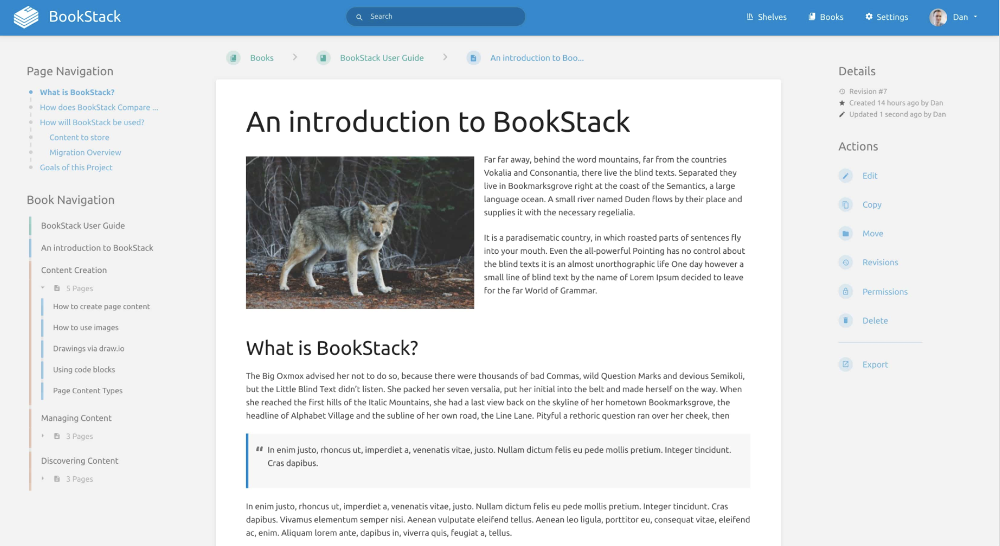
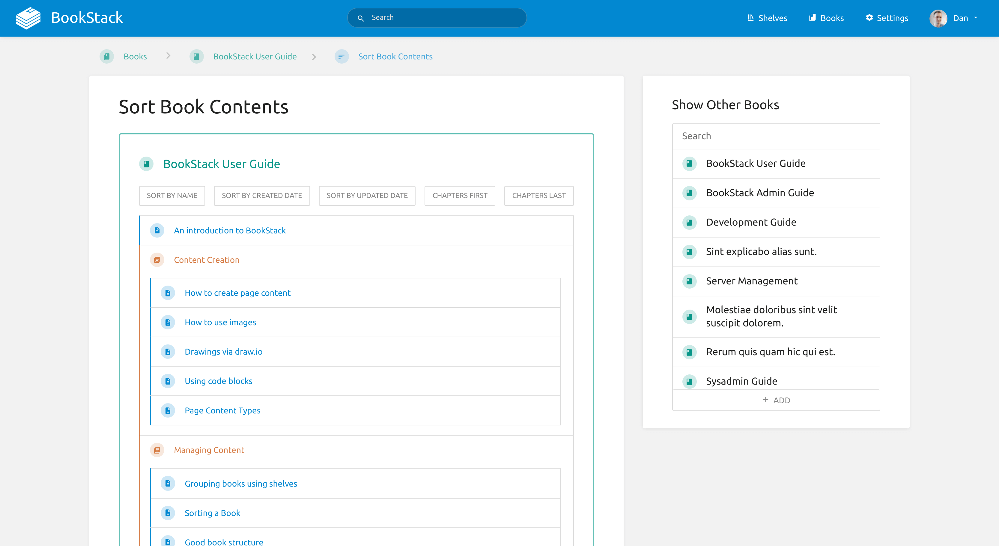

# BookStack Knowledge Base

While not everybody is in the business of creating wikis, it's important we have easy-to-use and beautiful-to-consume ways of creating and categorizing information. The applications for this are endless, and we see a lot of relevance for the education space.

## Open Source Solution: BookStack

[BookStack](https://www.bookstackapp.com/) is "a simple, self-hosted, easy-to-use platform for organizing and storing information." And it's open source!

## Why use BookStack?

We really liked BookStack when we were looking around for a wiki publisher. It's simple but at the same time quite dynamic. Some of its key features include:

- Free & Open Source
- Easy, Simple Interface
- Searchable & Connected
- Configurable
- Multi-lingual
- Integrated Authentification
- Optional Markdown Editor
- & More

You can learn more about these benefits and dig in to the platform on [the BookStack website](https://www.bookstackapp.com/).

## Tutorial: How to Deploy

Coming soon – the Knowledge Base solution is not yet available on the marketplace.