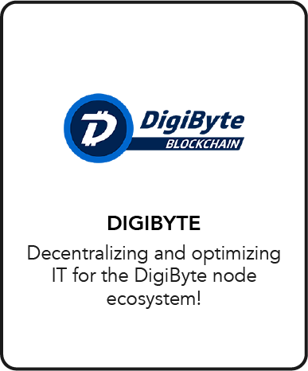

# DigiByte

## Joint Mission

Decentralizing and optimizing IT for the DigiByte node ecosystem!

## About DigiByte

**[DigiByte](https://digibyte.io/)** is a rapidly-growing open-source blockchain created in late 2013 and released in early 2014.

- After 6 years of forward-thinking development, DigiByte has become one of the safest, fastest, longest and most decentralized UTXO blockchains in existence with one of the most active communities in the Crypto and Blockchain space.
- The DigiByte Foundation is a volunteer-managed organization that operates as a non-profit.
- They protect and promote the true principles of decentralization and empower DigiByte and its community to establish and maintain a sustainable decentralized world.

## DigiByte and ThreeFold

Through our partnership with the DigiByte Foundation, we empower the DGB community with a decentralized cloud infrastructure to deploy DigiByte nodes and help secure and expand the DGB network across the geographical edges. 

- Anyone can contribute and build upon the DigiByte Blockchain using the ThreeFold P2P cloud and its developer tools that provide significant advantages over centralized cloud providers.
- Thousands of people are running DigiByte software all across the planet.
- Any server, computer, tablet or mobile phone connected to the DigiByte network becomes a node that helps relay transactions.

## Get Started 

**Coming soon:** You will be able to soon deploy your own DigiByte full Node via the **ThreeFold Now Marketplace**'s dashboard in a few clicks.

Stay tuned at **[Threefold Now Marketplace](https://marketplace.threefold.io)**.
