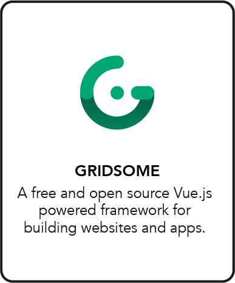

# Modern Site Generator

*Note: This page is being worked on and will be expanded.*

## Open Source Solution: Gridsome

[Gridsome](https://gridsome.org/) is a jamstack framework – a free & open source Vue.js-powered framework for building websites & apps that are fast by default.

## How does it work?

More info on https://gridsome.org/.

## Why use Gridsome?

## How is it related to our grid?

- Directly deploy on TF Grid
- Build & test before deploy

More coming ...

## Tutorial: How to Deploy

Coming soon – the Modern Site Generator solution is not yet available on the marketplace.

## FAQs

Coming ...