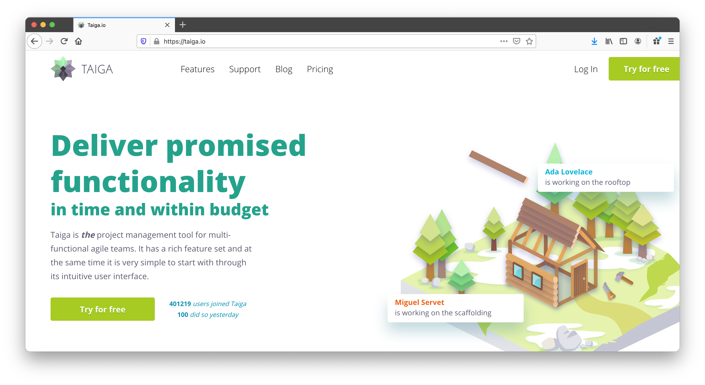

# Project Management (Taiga)

 

Our world is moving towards remote working, and with that comes many challenges – one of them being project management of remote teams. Therefore, it was super important to us to present this type of a solution in our marketplace.

## Open Source Solution: Taiga

- [Taiga](https://www.taiga.io/) is a tool that allows you to run projects following the Agile principles (if you're not familiar with Agile, see below).
- It presents various well known implementations of the Agile principles and allows you to manage any project in an Agile manner.
- Taiga is an [open source project](https://github.com/taigaio) and has a commercial [Software as a Service](https://taiga.io/) version for people that don't want to have the hassle of installing and maintaining it themselves.

## Why Taiga?

- At ThreeFold we love the agility and functionality the Taiga project management software provides us with and are using it for a number of different projects we run internally.
- These projects range from customer-facing and partnership acquisition to ThreeFold Tech product and software development.
- See the Taiga system working [here](https://circles.threefold.me/discover).
- We love the Taiga project and encourage you to help Taiga by paying for a commercial license (https://taiga.io/pricing).
- We at ThreeFold are planning to ask Taiga to be able to pay for license fees using TFT as part of the deployment wizard.

## Want to learn more about Agile? 

A new methodology has been developed to do exactly the same as traditional waterfall project management but allows for changes to happen in the process. Pioneered by the software industry but adopted by many other industries today is the **Agile** development methodology to organize and run projects. Agile promotes agility in running a project and lives by the following principles:
 
 

- **Individuals and interactions** over processes and tools
- **Working solutions** over comprehensive documentation
- **Customer collaboration** over contract negotiation
- **Responding to change** over following a plan

## Tutorial: How to Deploy

- First, visit the Project Management solution live on the marketplace
- You'll be asked to enter a solution name – this can be anything and is simply to identify your specific deployment and will also be used in the deployment's unique URL
- Next you'll be asked to enter an email address, your SMTP information, and a password
    - For testing purposes please note you do not have to include real information
    - If you want to test the email functionality for this tool, then you will have to include real information
        - Email should then be a valid email address you have access to.
        - If you don't know how to find your SMTP information, best option is to visit your preferred engine and type in "SMTP" or "find SMTP" and your email service and you should find the directions you need.
        - Password can be made up but again if you do want to test the email functionality, please include your real password for the specified email.
- Once you enter this information, all you need to do is wait for the solution to deploy. You can keep an eye on the screen for progress.
- Upon completion, you'll see a link to view your solution live and it will remain live in your My Workloads section for three hours.

<!--

## How can you and your business benefit?

ThreeFold gives you the ability to have a "one-click" solution to deploy your own project management system in many of the locations where the ThreeFold Grid has capacity.

Deploying your own instance on the grid provides you with unique features like:

- **A private instance**. It's your private instance running in you private virtual data center.
- **Choice of location**. Any node on the TF Grid is able to run the Taiga instance and we will make more locations to deploy going forward.
- **Decentralized User Authentication**. ThreeFold uses a 2-Factor Authentication system that doe not rely on central storage of a username and password combination.

-->