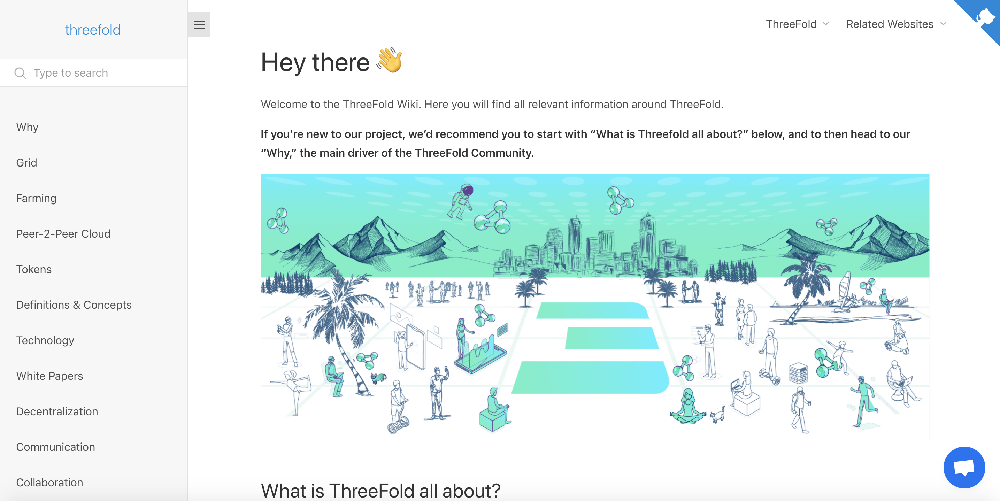

# Wiki Publisher

## How does it work?

For Wiki creation and management there are many options available in the market. ThreeFold has created a very simple tool that allows for deployment and Wiki management with version control, automatic update, and staging facilities.

## What do you need to do?

First, please note that in order to deploy a wiki using this tool, you'll need some technical knowledge of Git.
 
 
The basic principle is that you create the content in the repository (markdown) and store it in a repository. Content creation can be done with any tools that you have experience with (or like). The only requirement is that you store the content in a public repository. This repository can be anything that stores code and provides version controlling. For example, you can use Github, but also ThreeFold's decentralized Gitea solution. The actual deployment of the wiki infrastructure and all required domain name setup for the wiki to be publicly available is done in the one-click (and three question) deployment.
 
 
See [ThreeFold Main Wiki](https://new.threefold.io/info/threefold) as an example.

## How to Deploy

Please visit [the Marketplace Wiki](https://new.threefold.io/info/cloud#/cloud__evdc_marketplace) to find instructions!
 
 
If you need any support, please join [our Testing Community](https://bit.ly/tftesting) or visit [our forum](https://forum.threefold.io)!

<!--
### Deploy

create widget which does following,
widget needs to be here in iframe

- [ ] size: small/mid/large
  - small limited amount of visitors per month
  - large ...
- [ ] location (mention more locations coming soon)
  - Ghent
  - Vienna
- [ ] name
  - name as used in solution (in the webui and on web)
- [ ] domain (name is prefix of this)
  - ava.tf
  - 3x0.me
  - refit.earth
  - co30.org
  - ninja.tf
  - base.tf
  - tf9.io
- [ ] git url
  - check in wizard git url works
- [ ] sshkey yes/no
  - if yes, ask sshkey for remote login

  - always deploy on ipv6 public
  - always deploy on webgateway

## Manual

- link to manual (TODO: check good enough)

 -->
