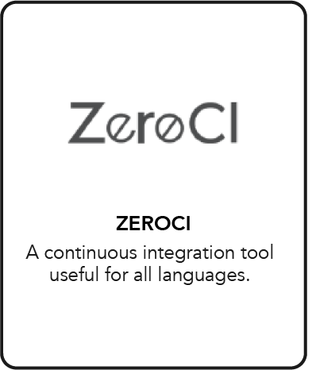
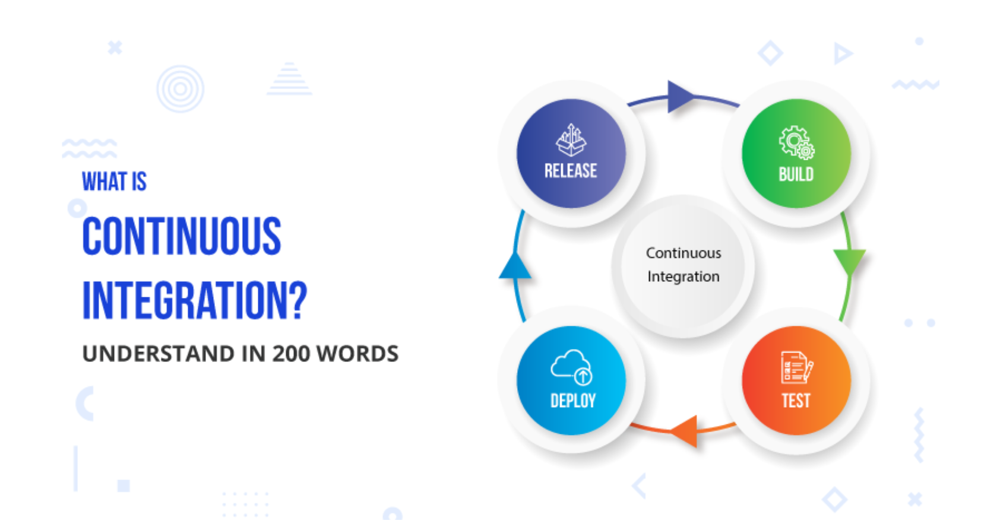

# Continuous Integration Tool

*Note: This page is being worked on and will be expanded.*

Continuous Integration (CI) is a development practice that requires developers to integrate code into a shared repository several times a day. Each check-in is then verified by an automated build, allowing teams to detect problems early.

## What is ZeroCI?

[ZeroCI](https://github.com/threefoldtech/zeroCI) is a continuous integration tool useful for all languages but has some specific features for python projects that generates test summary into xml file and it is integrated with version control systems and Telegram.

(Note: Version control systems supported are Github and Gitea)

## Why use ZeroCI?

ZeroCI is a continuous integration tool for developers looking to build on top of the decentralized ThreeFold Grid.

## Tutorial: How to Deploy

Coming soon – the Continuous Integration Tool is not yet available on the marketplace.
