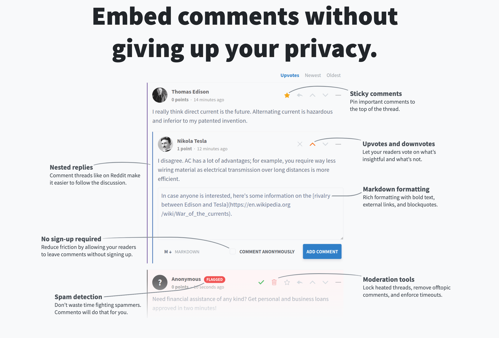
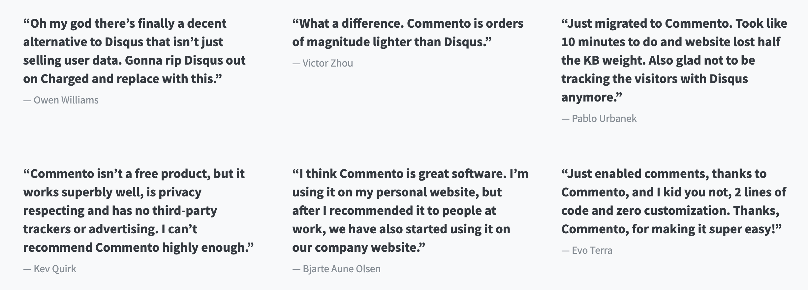

# Comments Widget

*Note: This page is being worked on and will be expanded.*

Today, there are various solutions out there like Disqus and Facebook which allow you to comment on blog posts, articles, and other online content with a simple login. These tools are easy-to-use and free, but they come with the "cost" of giving up your privacy and personal data.

## Open Source Solution: Commento

It's quite simple, [Commento](https://commento.io/) lets you embed comments without giving up your privacy.

## Why Commento?

We are very much in line with Commento and they say "why" best themselves:

"Commento is more than just a comments widget you can embed — it’s a return to the roots of the internet. An internet without the tracking and invasions of privacy. An internet that is simple and lightweight. An internet that is focused on interesting discussions, not ads. A better internet."

Commento has nice features as well – clean design, sticky comments, upvotes and downvotes, nested replies, spam detection, and more. So you don't lose out on functionality, and you gain a whole lot more.

Commento does come with a cost, but as they say on their site, "Services like Disqus and Facebook comments aren't really free — you pay by giving up your privacy and personal data. Unlike them, we don't sell your data, show you ads, or track your every movement on the web." So, you can pay $10 per month or $50 per year as long as you stay under a certain traffic threshold, otherwise it is a bit more.

## Tutorial: How to Deploy

Coming soon – the Comments Widget is not yet available on the marketplace.

## FAQs

Coming soon ...