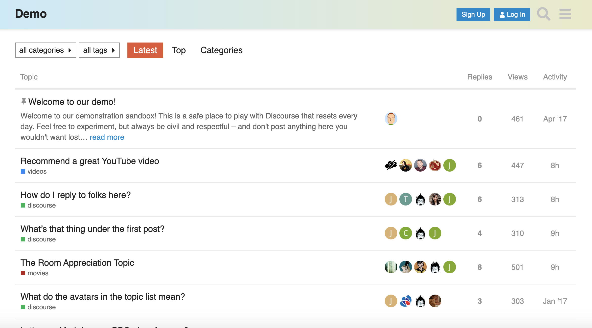

# Community Forum

*You can access the Community Forum solution on the ThreeFold Now Marketplace directly [here](https://marketplace.threefold.io/marketplace/#/solutions/discourse). Please note that the marketplace is currently running on testnet.*

Online communities have been around for decades and they are only increasing in importance and popularity in today's world. We wanted to provide people with an easy (and fun) to use solution to build and manage safe and trusted online communities of their own.

## Open Source Solution: Discourse

[Discourse](https://www.discourse.org/) is modern forum software for your community. Use it as a mailing list, discussion forum, long-form chat room, and more!

## Why Discourse?

We are big fans of Discourse and actually use it for [our forum](https://forum.threefold.io). But why do we love Discourse? Here are a few reasons:

- It's 100% open source which means we're able to bring it as a solution on ThreeFold Now!
- The trust system allows the community to easily defend itself from trolls and spammers — and the most engaged forum members can assist in the community's governance. This one is an important differentiator based on our own experience on other platforms.
- Discourse is simple, easy, and well-organized – and has great experiences on desktop and on mobile

Bonus! Discourse has integration features with [Mattermost](https://mattermost.com/), which is also part of the ThreeFold Now suite.

## Tutorial: How to Deploy

- First, visit [the Community Forum solution](https://marketplace.threefold.io/marketplace/#/solutions/discourse) live on the marketplace
- You'll be asked to enter a solution name – this can be anything and is simply to identify your specific deployment and will also be used in the deployment's unique URL
- Next you'll be asked to enter an email address, your SMTP information, and a password
    - For testing purposes please note you do not have to include real information
    - If you want to test the email functionality for this tool, then you will have to include real information
        - Email should then be a valid email address you have access to.
        - If you don't know how to find your SMTP information, best option is to visit your preferred engine and type in "SMTP" or "find SMTP" and your email service and you should find the directions you need.
        - Password can be made up but again if you do want to test the email functionality, please include your real password for the specified email.
- Once you enter this information, all you need to do is wait for the solution to deploy. You can keep an eye on the screen for progress.
- Upon completion, you'll see a link to view your solution live and it will remain live in your My Workloads section for three hours.