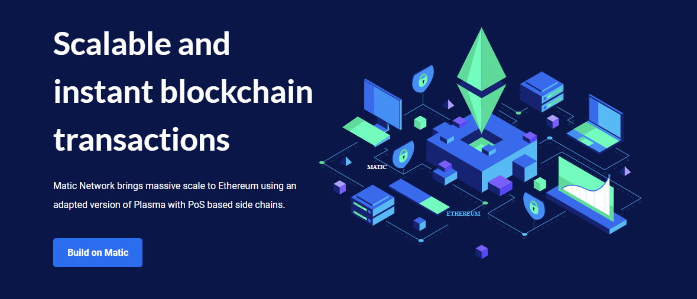

# Matic Network

## Joint Mission

Distributing Matic's Blockchain across the edges!

## About Matic Network

**[Matic Network](https://matic.network/)** is a decentralized scalability platform solution using an adapted version of the Plasma framework that empowers Ethereum-based DApps with the high-speed and extremely low-cost transactions required to achieve mass adoption.

- With 60+ DApps building on their network already, Matic Network is one of the most widely adopted DApp platforms in the industry.
- The Matic Network blockchain achieves finality using PoS checkpoints which are pushed to the Ethereum mainchain.
- This enables a single Matic sidechain to theoretically achieve 65,535 transactions per block, and possibly millions of transactions on multiple chains in the future.

## Matic Network and ThreeFold

Matic and ThreeFold joined forces to provide key benefits in successfully running a validator node and other related IT workloads on the Matic Blockchain, which are primarily the ease-of-deployment, customization, privacy, and monitoring.

- By leveraging the ThreeFold P2P Cloud and 3Bot, the Matic community – developers and non-developes – receive all of these benefits.
- They can easily get started and run their own validators nodes for their staking directly from the web, and in just a few clicks. 
- Together we will expand Matic's community-led Blockchain across the geographical edges, while creating a more inclusive and cost-effective participation model for anybody on earth to be involved in the growing Matic ecosystem. 

## Get started with Matic

**Coming soon:** You will be able to soon deploy a Matic validator node via the **ThreeFold Now Marketplace**'s dashboard in a few clicks.

Stay tuned at **[Threefold Now Marketplace](https://marketplace.threefold.io)**.